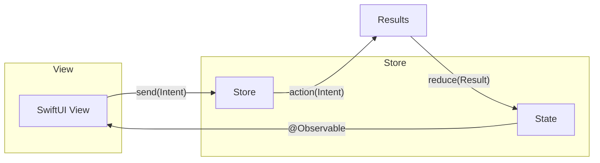
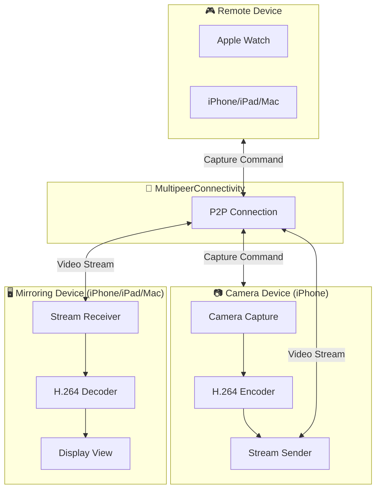

<div align="center">

# 📹 미러링부스


### 내 손 안의 포토부스

**가장 선명하게, 우리다운 순간을 기록하다.**

포토부스를 찾아갈 필요 없이, Apple 기기만 있으면 어디서나 시작되는 인생N컷

<br>

📥 **[앱 다운로드](https://appbox.me/xepf4oo8)** &nbsp;&nbsp;|&nbsp;&nbsp; 📸 QR로 다운로드


<br>

### 👥 왔다감

<table>
<thead>
<tr>
<th align="center">S022 윤대현</th>
<th align="center">S024 이상유</th>
<th align="center">S029 전귀로</th>
<th align="center">S038 최윤진</th>
</tr>
</thead>
<tbody>
<tr>
<td align="center">

</td>
<td align="center">

</td>
<td align="center">

</td>
<td align="center">

</td>
</tr>
<tr>
<td align="center">위키 리더</td>
<td align="center">UI/UX 리더</td>
<td align="center">팀 리더</td>
<td align="center">테크 리더</td>
</tr>
</tbody>
</table>

</div>

---

## 📄 목차

- [📜 프로젝트 개요](#-프로젝트-개요)
- [✨ 주요 기능](#-주요-기능)
- [📱 지원 기기](#-지원-기기)
- [🛠 기술 스택](#-기술-스택)
- [🏛️ 시스템 아키텍처](#️-시스템-아키텍처)
- [📂 프로젝트 구조](#-프로젝트-구조)
- [🔗 관련 문서](#-관련-문서)

---

## 📜 프로젝트 개요

후면 카메라는 화질이 좋지만 촬영 시 내 모습을 볼 수 없어, 결국 화질이 낮은 전면 카메라를 쓰거나 "찍고 확인하고 다시 찍는" 과정을 반복하게 됩니다.

**미러링부스**는 iPhone 후면 카메라의 고화질을 유지하면서, iPad나 Mac의 넓은 화면에서 **실시간으로 구도를 확인**하며 촬영할 수 있는 멀티 디바이스 포토부스 앱입니다. 집, 카페, 여행지 등 Apple 기기가 있는 모든 곳이 나만의 스튜디오가 됩니다.

---

## ✨ 주요 기능

| 기능 | 설명 |
|:---:|---|
| 🔄 **실시간 미러링** | iPhone 카메라 화면을 다른 Apple 기기에 실시간으로 고화질 스트리밍 |
| 🎮 **원격 촬영** | iPad, Mac, Apple Watch 등 모든 기기에서 촬영 버튼 조작 가능 |
| ⏱️ **타이머 촬영** | 8초 카운트다운 후 8초 간격으로 10장 자동 촬영 |
| 🖼️ **포토 프레임 합성** | 촬영한 사진을 인생네컷 스타일의 예쁜 프레임에 자동 합성 |
| ⌚ **Apple Watch 지원** | 손목에서 바로 촬영 버튼을 눌러 가장 편리하게 촬영 |

---

## 📱 지원 기기

보유한 Apple 기기를 자유롭게 조합하여 사용하세요!

| 역할 | 기기 | 최소 버전 |
|:---:|---|---|
| 📷 **촬영** (카메라) | iPhone | iOS 17.0+ |
| 🖥️ **미러링** (실시간 확인) | iPhone, iPad, Mac | iOS/iPadOS 17.0+, macOS 14.0+ |
| 🎮 **리모트** (촬영 버튼) | iPhone, iPad, Mac, Apple Watch | iOS/iPadOS 17.0+, macOS 14.0+, watchOS 10.0+ |

**조합 예시**
- 📱 iPhone(카메라) + 📱 iPhone(미러링)
- 📱 iPhone(카메라) + 🖥️ iPad(미러링)
- 📱 iPhone(카메라) + 💻 Mac(미러링) + ⌚ Watch(리모트)

> ⚠️ 원활한 동작을 위해 **Bluetooth** 또는 **Wi-Fi**가 켜져 있어야 합니다.

---

## 🛠 기술 스택

| 구분 | 스택 |
|---|---|
| **Platform** |    |
| **Language** |  |
| **UI** |   |
| **Connectivity** |   |
| **Media** |   |
| **Async** |   |
| **Tools** |   |
| **CI/CD** |    |

### 아키텍처 (MVI)

프로젝트는 **MVI (Model-View-Intent)** 패턴을 사용합니다.



| 구성 요소 | 역할 |
|:---:|---|
| **State** | View가 표시할 현재 상태 |
| **Intent** | 사용자 액션을 나타내는 이벤트 |
| **Result** | Intent 처리 결과, State를 변경 |
| **Store** | Intent를 받아 Result를 생성하고 State를 업데이트 |

---

## 🏛️ 시스템 아키텍처



**주요 컴포넌트**
- **Camera Device**: iPhone 후면 카메라로 촬영, H.264 인코딩 후 스트리밍
- **Mirroring Device**: 스트림 수신 및 디코딩하여 실시간 미러링 화면 표시
- **Remote Device**: 원격 촬영 명령 전송 (Apple Watch 포함)
- **MultipeerConnectivity**: 모든 기기 간 P2P 통신 담당

---

## 📂 프로젝트 구조

```
mirroringBooth/
├── App/                          # 앱 진입점 및 루트 구성
│   ├── mirroringBoothApp.swift   # @main 앱 엔트리
│   ├── AppDelegate.swift         # 앱 생명주기 관리
│   ├── RootView.swift            # 루트 뷰
│   └── RootStore.swift           # 루트 상태 관리
│
├── Core/                         # 공통 인프라
│   ├── StoreProtocol.swift       # MVI 아키텍처 프로토콜
│   ├── Router.swift              # 화면 전환 라우팅
│   ├── AppLogger.swift           # 로깅 유틸리티
│   └── PlistRepository.swift     # Plist 데이터 관리
│
├── Device/                       # 기기별 기능 모듈
│   ├── Camera/                   # 📷 촬영 기기 모드
│   │   ├── Browser/              # 연결 기기 탐색
│   │   ├── Streaming/            # 영상 스트리밍
│   │   └── Model/                # 카메라 모델
│   │
│   ├── Mirroring/                # 🖥️ 미러링 기기 모드
│   │   ├── Streaming/            # 스트림 수신 및 표시
│   │   ├── PhotoComposition/     # 프레임 합성
│   │   ├── PhotoResult/          # 결과 저장 및 공유
│   │   ├── PoseSuggestion/       # 포즈 가이드
│   │   └── ModeSettings/         # 촬영 모드 설정
│   │
│   ├── Remote/                   # 🎮 리모트 기기 모드
│   │   └── AppleWatch/           # 워치 연동
│   │
│   └── Common/                   # 공통 컴포넌트
│       ├── Component/            # 재사용 UI 컴포넌트
│       ├── AccessManager/        # 권한 관리
│       └── HeartBeater/          # 연결 상태 모니터링
│
└── Resources/                    # 리소스 파일
    └── Assets.xcassets           # 이미지, 색상 등
```

---

## 🔗 관련 문서

더 자세한 정보는 프로젝트 위키에서 확인할 수 있습니다.

| 문서 | 링크 |
|---|---|
| 📋 그라운드 룰 | [Wiki 링크 추가](#) |
| 📝 기획서 | [Wiki 링크 추가](#) |
| 🏗️ 설계서 | [Wiki 링크 추가](#) |
| 📊 프로덕트 백로그 | [Wiki 링크 추가](#) |
| 🎬 유저 시나리오 | [Wiki 링크 추가](#) |
